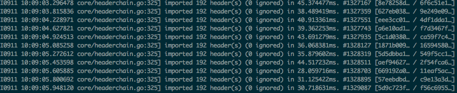
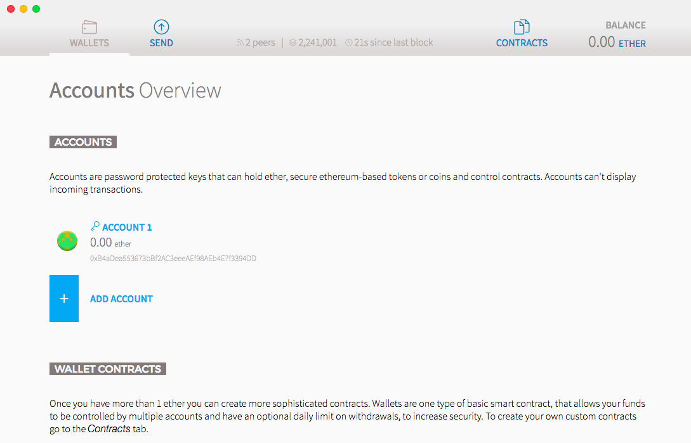

# Setup for Ethereum Usage & Development

To interact with the ethereum network you need two pieces of software. Firstly, an node which can talk to the ethereum network and secondly an interface for this node. We will use [geth](https://github.com/ethereum/go-ethereum) as the node and [Mist](https://github.com/ethereum/mist) as the interface. You can think of these two units of software like sections of OS that deal with setting TCP/IP connections on the web and your web browser which takes care of HTTP to interact with websites.

After you have these, we will also need to install some tools for compiling and simulating contract code.

### Geth, an Ethereum node in GoLang
Geth, being a full blockchain node, can do the work of downloading and validating the entire blockchain. A piece of software that can do that also has the power to then notify you of activity on the block chain relevant to you and also broadcast your actions to the network.

Downloading the entire blockchain from scratch takes a very long time. Thankfully, `zsfelfoldi` built a [light client](https://github.com/zsfelfoldi/go-ethereum/wiki/Light-Client-Public-Test) which will take just ~2 minutes to sync. To build and run this application, you will first need to have Go.

- The full releases page: https://golang.org/doc/install
- The current OSX release: https://golang.org/doc/install?download=go1.7.1.darwin-amd64.pkg

Run `which go` in a new terminal to make sure installation worked.

Once you have Go, you can git clone a branch for the light client and build.
```bash
git clone -b light-stable https://github.com/zsfelfoldi/go-ethereum.git

cd go-ethereum
make geth

# begin syncing the blogchain
build/bin/geth --light
```


When testing ethereum contracts it is often useful to use the testnet (which is entirely free!). To run geth in testnet mode use the line below and then start (or restart) Mist so that it knows to be using your tesnet accounts.
```bash
# linux
build/bin/geth --light --testnet --ipcpath $HOME/.ethereum/geth.ipc

# osx
build/bin/geth --light --testnet --ipcpath /Users/<name>/Library/Ethereum/geth.ipc
```

### Mist, a browser for the Ethereum network
While your node is syncing we can download the Mist wallet. When Mist runs it will automatically see your geth node running and then communicate to it via RPC.

- Full list of releases is [here](https://github.com/ethereum/mist/releases) and you might need to scroll down to get to the list of zip files. Download the one for your OS and start the app which should look like this.



Once you have Mist running, switch it to the testnet (aka Morden) by going to `Developt > Network > Testnet (Morden)` and create an account.
Once you have an address go to the [ZeroGox faucet](https://zerogox.com/ethereum/wei_faucet) and enter you address. A faucet is a place where some free ethereum will be given to you. It is on the testnet and so is not actually worth anything but is useful for testing. After ~20 seconds the ether should appear in you account in Mist.

### Dev Tools for Ethereum Contracts
Currently, there are two languages that you can write contracts in - Serpent (more python like) and Solidity (more Javascript like). In this tutorial I will be using Serpent. We will need the following:

- [python](https://www.python.org/downloads/)
- [serpent](https://github.com/ethereum/serpent)
- [pyethereum](https://github.com/ethereum/pyethereum) (used for local simulation)

Installation of these tools has shown to be far less easy than the applications above and so if you are familiar with Docker, your best bet is to simply run a container with everything installed. If you prefer to install directly on your host machine, that is explained below.

#### Docker
```bash
# if you perfer to build the image locally
docker build -t serpent .
docker run --rm -it -v $(pwd):/home/ethereum serpent

# if you prefer to download the image from docker hub
docker pull jborrey/serpent:latest
docker run --rm -it -v $(pwd):/home/ethereum jborrey/serpent:latest
```
Since we volumed in your current directory to `/home/ethereum` you can just use your native text editor on files you are editing and go to the interactive docker container only for running `serpent` or `pyethereum`.

#### Host Installation
If you are not familiar with Docker, you will need to install everything natively. On OSX this could turn out to be very painful.

- Download python and install as specified on [the website](https://www.python.org/downloads/).

##### Install Serpent
```bash
git clone https://github.com/ethereum/serpent.git
cd serpent
make
make install # might require sudo
sudo python setup.py install
which serpent # check
```

##### Install Pyethereum Simulator
```bash
# for OSX, if you don't use python often, I recommend having a fresh version
brew reinstall python
brew reinstall libtool # latest of this also helps

git clone https://github.com/ethereum/pyethereum.git

# install requirements
pip install -r requirements.txt # might require sudo

sudo python setup.py install
# if you get "error: ('The read operation timed out',)", just re-run the command
```

##### Test Editor
If you use Vim you can add these lines to your `~/.vimrc` file to quickly get some syntax highlighting on your serpent file. Assumes you already have `syntax on`.
```
" python highlighting for .se (serpent) files
au BufNewFile,BufRead *.se set filetype=python
```
